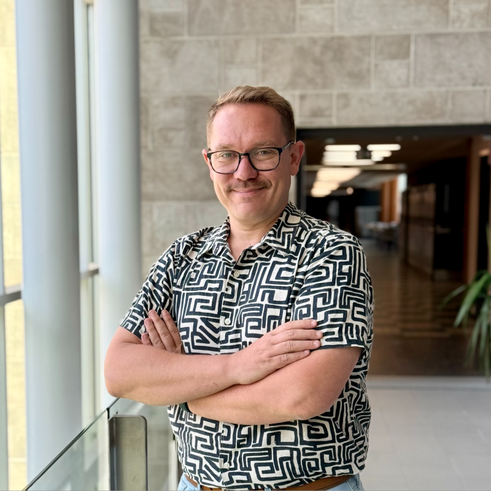

::: {.about-page}
::: {.resource-hero}
# À propos de Données bleues

Une plateforme destinée aux personnes qui enseignent ou étudient la statistique, R et la science des données.
:::

::: {.founder-card}
::: {.founder-photo}
{width=200 height=200 fig-alt="Portrait d’Aurélien Nicosia, créateur et mainteneur de Données bleues"}

[Photo du profil LinkedIn](https://www.linkedin.com/in/aur%C3%A9lien-nicosia-6a52487b/)
:::
::: {.founder-bio}
## Aurélien Nicosia

::: {.founder-role}
Créateur et mainteneur de la plateforme
:::

Aurélien Nicosia, chargé d’enseignement en mathématiques et statistique à l’Université Laval, a créé Données bleues. Il développe la plateforme, en assure la maintenance et conçoit ses ressources pédagogiques originales.

[Profil GitHub](https://github.com/AurelienNicosiaULaval) · [Site personnel](https://aureliennicosiaulaval.github.io/web_site/) · [ORCID](https://orcid.org/0000-0002-0974-9988) · [LinkedIn](https://www.linkedin.com/in/aur%C3%A9lien-nicosia-6a52487b/)

:::
:::


## Contributeurs {#contributeurs}

Les contributions au répertoire sont présentées ci-dessous. Les organismes producteurs des données et les auteurs des documents externes sont crédités dans les notices des ressources.

::: {.founder-card .contributor-card #contributeur-julien-miron}
::: {.founder-photo}


[Photo du profil LinkedIn](https://www.linkedin.com/in/julien-miron-183606388/)
:::
::: {.founder-bio}
### Julien Miron

Julien Miron enseigne la statistique à l’Université Laval. Il a assemblé et proposé le jeu qui associe la demande horaire d’électricité d’Hydro-Québec aux températures observées par Environnement et Changement climatique Canada.

[Consulter sa fiche de données](datasets/hydro-quebec-temperature/fiche.qmd) · [Ses contributions](ressources.html?query=Julien%20Miron)

[Profil GitHub](https://github.com/JulienMiron) · [LinkedIn](https://www.linkedin.com/in/julien-miron-183606388/)
:::
:::

::: {.founder-card .contributor-card .contributor-card-no-photo #contributrice-anne-sophie-charest}
::: {.founder-bio}
### Anne-Sophie Charest

Anne-Sophie Charest est professeure agrégée en statistique à l’Université Laval et contributrice à Données bleues.

[Profil à l’Université Laval](https://www.ulaval.ca/la-recherche/repertoire-corps-professoral/anne-sophie-charest)
:::
:::

```{r}
#| echo: false
#| results: asis
source("R/utils_resources.R")
items <- resource_catalogue()
contributors <- sort(unique(vapply(items, function(item) resource_text(item$contributor, ""), character(1))))
# Les personnes présentées dans une carte ne sont pas répétées dans les crédits automatiques.
profiled_contributors <- c("Aurélien Nicosia", "Julien Miron", "Anne-Sophie Charest")
for (name in setdiff(contributors[nzchar(contributors)], profiled_contributors)) {
  count <- sum(vapply(items, function(item) identical(resource_text(item$contributor, ""), name), logical(1)))
  cat('<p><a href="ressources.html?query=',utils::URLencode(name,reserved=TRUE),'">',resource_escape(name),'</a> : contribution à ',count,
      if (count == 1L) ' ressource. Le rôle détaillé figure dans sa notice.</p>' else ' ressources. Les rôles détaillés figurent dans leurs notices.</p>',sep='')
}
```

## Nous contacter

Une question sur la plateforme, une ressource ou une collaboration ? Écrivez-nous à [info@donneesbleues.ca](mailto:info@donneesbleues.ca).

## Participer au projet

Le formulaire accepte des données, activités, documents, outils, tutoriels et corrections, sans compte GitHub.

[Proposer une ressource](contribuer.qmd){.dataset-button}

[Consulter le guide du site](guide.qmd) · [Licences et réutilisation](guide.qmd#licences-et-réutilisation){#licences-et-réutilisation} · [Version et citation](guide.qmd#version-et-citation){#version-et-citation}

:::
