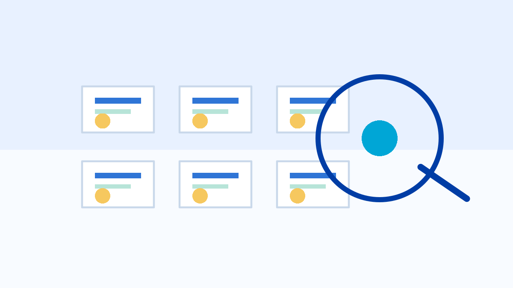
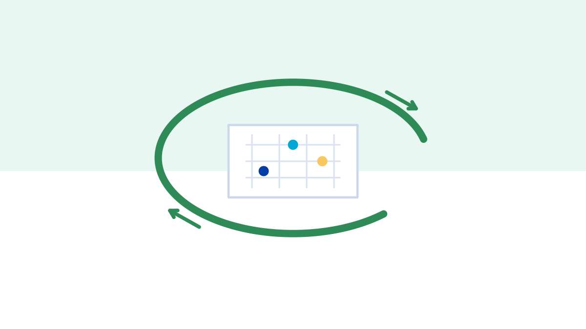

::: {.hero}

# Données bleues

::: {.subtitle}
Des données québécoises pour enseigner la statistique et la science des données.
:::

::: {.lede}
Un jeu de données n'est pas seulement une table. C'est un territoire d'apprentissage. Données bleues transforme des données ouvertes québécoises en ressources pédagogiques prêtes à utiliser : fiches, activités, scripts R, grilles d'analyse et pistes de projet.
:::
:::

## Jeux de données québécois

Ces jeux de données québécois permettent d'aborder des questions concrètes liées à l'eau, à l'environnement et aux politiques publiques, tout en développant des compétences en visualisation, analyse exploratoire, statistiques descriptives et modélisation.

::: {.card-grid}
::: {.db-card}

### Explorer les jeux de données

Consulter le catalogue, comparer les thèmes et repérer les concepts enseignables.

[Ouvrir le catalogue](catalogue.qmd)
:::

::: {.db-card}

### Comprendre le jeu de données zéro déchet

Évaluer le rendement pédagogique d'un jeu de données sans le réduire à sa taille.

[Lire le cadre](zero-waste.qmd)
:::

::: {.db-card}

### Utiliser les activités en classe

Adapter des activités courtes et longues pour des cours d'introduction à la statistique ou à la science des données.

[Voir les activités](activites.qmd)
:::
:::

## Pourquoi des données québécoises?

Les données locales aident à situer les apprentissages dans des réalités proches des personnes étudiantes : mobilité urbaine, services publics, culture, environnement, territoire et politiques publiques. Elles permettent aussi d'aborder la donnée comme objet social, administratif et scientifique.

Le MVP initial utilise des sources ouvertes vérifiées le 2026-06-01, notamment Données Québec, les flux GBFS de BIXI Montréal, Bibliothèque et Archives nationales du Québec et le ministère de l'Environnement, de la Lutte contre les changements climatiques, de la Faune et des Parcs. Les fiches récentes documentent leurs sources, formats, licences ou conditions de réutilisation directement dans les métadonnées.

## Pour qui?

- Enseignants et enseignantes en statistique, science des données et programmation R.
- Étudiants et étudiantes qui apprennent à analyser des données réelles.
- Responsables de programmes qui cherchent des exemples contextualisés.
- Personnes qui développent des ressources éducatives libres.

## Ce que contient une fiche

Chaque fiche vise à être utilisable sans longue préparation :

- une source vérifiée;
- une description de l'unité statistique;
- un tableau des variables principales;
- une grille zéro déchet;
- une activité courte;
- une activité longue;
- un projet possible;
- un bloc de code R minimal;
- des limites d'interprétation.

## Catalogue actuel

Le catalogue rassemble des fiches de jeux de données québécois sur l'environnement, l'eau, la mobilité, l'éducation, la démographie, la sécurité publique, les services municipaux et les politiques publiques. Il inclut maintenant six fiches adaptées aux laboratoires de science des données.

Le projet inclut aussi des fonctions R pour interroger CKAN, calculer les scores zéro déchet, bâtir le catalogue et vérifier la cohérence des fiches.

## Invitation à contribuer

Données bleues est conçu comme une infrastructure pédagogique ouverte. Les contributions les plus utiles pour la suite sont des sources vérifiées, des activités testées en classe, des corrigés enseignants et des améliorations reproductibles aux scripts R.

[Voir comment contribuer](contribuer.qmd)
