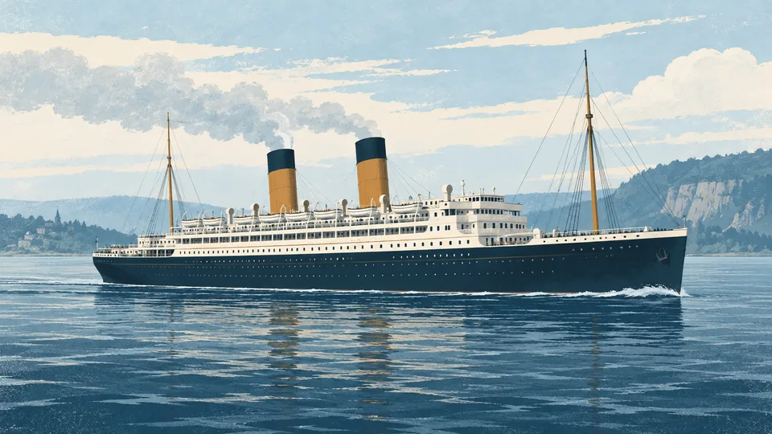

[Actualités](../actualites.qmd) / Empress of Ireland et Titanic

::: {.news-article-hero}
::: {.news-article-copy .resource-detail-header}
```{r}
#| echo: false
#| results: asis
source(if (file.exists("R/utils_resources.R")) "R/utils_resources.R" else "../R/utils_resources.R")
render_resource_notice_identity("billet-empress-of-ireland-titanic")
```

# Vous enseignez avec Titanic? Découvrez l’Empress of Ireland

::: {.news-byline}
Données bleues · <time datetime="2026-09-07">7 septembre 2026</time> · À découvrir
:::

Le tableau `Titanic` fait travailler les tableaux croisés, les proportions et les associations entre variables. Avec l’Empress of Ireland, on peut reprendre ces questions dans un contexte québécois, à partir des comptes du rapport canadien d’enquête.

Ce billet revient sur le jeu ajouté à Données bleues le 7 septembre 2026 et porte la date de cet ajout.

[Découvrir le jeu Empress of Ireland](../datasets/empress-of-ireland/fiche.qmd){.dataset-button}
:::

::: {.news-article-art}
{fig-alt="Illustration de l’Empress of Ireland sur le Saint-Laurent, dans des tons bleus et turquoise"}

[Crédits de l’illustration](../credits-images.qmd#illustrations-du-catalogue)
:::
:::

::: {.news-article-body}
## Comparer les deux jeux

La comparaison concerne ici le [tableau `Titanic` fourni avec R](https://stat.ethz.ch/R-manual/R-patched/library/datasets/html/Titanic.html). Ses effectifs sont croisés selon la classe, le sexe, la catégorie d’âge et la survie. Le [jeu pédagogique Empress of Ireland, version 1.0.0](https://github.com/AurelienNicosiaULaval/empress-of-ireland-data/releases/tag/v1.0.0), reprend cette structure pour les passagers.

Une différence compte dès le départ : `Titanic` réunit passagers et équipage, tandis que le tableau principal de l’Empress contient seulement les passagers. Le comparateur sépare donc la structure des fichiers de la comparaison des passagers seuls. Choisissez une rubrique ou affichez seulement les différences pour repérer ce qui change d’un jeu à l’autre.

:::

::: {.news-comparator data-comparator="empress-titanic"}
```{=html}
<div class="comparison-controls">
  <div class="comparison-views" role="group" aria-label="Rubriques de comparaison">
    <button type="button" data-compare-view="all" aria-pressed="true" aria-controls="empress-titanic-table">Tout comparer</button>
    <button type="button" data-compare-view="data" aria-pressed="false" aria-controls="empress-titanic-table">Données</button>
    <button type="button" data-compare-view="teaching" aria-pressed="false" aria-controls="empress-titanic-table">Pour la classe</button>
    <button type="button" data-compare-view="sources" aria-pressed="false" aria-controls="empress-titanic-table">Sources</button>
  </div>
  <label class="comparison-differences"><input type="checkbox" data-compare-differences aria-controls="empress-titanic-table"> Afficher seulement les différences</label>
</div>
```

```{r}
#| echo: false
#| message: false
#| warning: false
#| results: asis
library(readr)
library(dplyr)
library(htmltools)
library(jsonlite)

# Le rendu utilise la trousse locale figée, sans consultation du réseau.
site_root <- if (file.exists("assets/classroom/empress-of-ireland.zip")) "." else ".."
archive <- file.path(site_root, "assets/classroom/empress-of-ireland.zip")
receipt <- read_json(paste0(archive, ".json"))
stopifnot(identical(receipt$source_url,
  "https://github.com/AurelienNicosiaULaval/empress-of-ireland-data/releases/tag/v1.0.0"))
empress <- read_csv(unz(archive,
  "data/processed/empress-of-ireland/empress_passengers.csv"),
  show_col_types = FALSE)
crew <- read_csv(unz(archive,
  "data/processed/empress-of-ireland/empress_crew_groups.csv"),
  show_col_types = FALSE)
titanic_all <- as.data.frame(datasets::Titanic)
titanic_passengers <- titanic_all |> filter(Class != "Crew")

empress_total <- sum(empress$frequency)
empress_survivors <- sum(empress$frequency[empress$survived == 1])
titanic_total <- sum(titanic_passengers$Freq)
titanic_survivors <- sum(titanic_passengers$Freq[titanic_passengers$Survived == "Yes"])
stopifnot(nrow(empress) == 24L, ncol(empress) == 7L,
  empress_total == 1057, empress_survivors == 217,
  titanic_total == 1316, titanic_survivors == 499)

format_count <- function(x) format(x, big.mark = "\u202f", scientific = FALSE, trim = TRUE)
format_percent <- function(x) paste0(formatC(100 * x,
  format = "f", digits = 1, decimal.mark = ","), " %")
# Les critères communs sont identifiés explicitement pour le filtre des différences.
comparison <- data.frame(
  group = c(rep("data", 9), rep("teaching", 3), rep("sources", 2)),
  criterion = c("Format", "Unité d’observation", "Population du tableau principal",
    "Variables communes", "Âge exact par personne", "Équipage",
    "Passagers seuls", "Survivants parmi les passagers", "Proportion de survie des passagers",
    "Démarrer dans R", "Questions statistiques", "Accompagnement",
    "Origine des effectifs", "Traçabilité"),
  Empress = c(
    paste0(nrow(empress), " lignes de fréquences, ", ncol(empress), " colonnes"),
    "Cellule d’un tableau de fréquences",
    paste0(format_count(empress_total), " passagers"),
    "Classe, sexe, catégorie d’âge et survie",
    "Non : catégories adulte et enfant",
    paste0("Table distincte : ", nrow(crew), " groupes, ", format_count(sum(crew$total)), " personnes"),
    format_count(empress_total), format_count(empress_survivors),
    format_percent(empress_survivors / empress_total),
    "Importer le fichier CSV versionné avec readr::read_csv()",
    "Tableaux croisés, proportions et visualisation",
    "Fiche, dictionnaire, trousse R et activité exploratoire corrigée",
    "Rapport canadien d’enquête de 1914, pages 608, 610 et 611",
    "Page du rapport et méthode de dérivation conservées dans le CSV"),
  Titanic = c(
    paste0("Tableau à ", length(dim(datasets::Titanic)), " dimensions, ", nrow(titanic_all), " cellules"),
    "Cellule d’un tableau de fréquences",
    paste0(format_count(sum(titanic_all$Freq)), " personnes, équipage compris"),
    "Classe, sexe, catégorie d’âge et survie",
    "Non : catégories adulte et enfant",
    paste0("Catégorie Crew : ", format_count(sum(titanic_all$Freq[titanic_all$Class == "Crew"])), " personnes"),
    format_count(titanic_total), format_count(titanic_survivors),
    format_percent(titanic_survivors / titanic_total),
    "Charger le tableau déjà inclus dans R avec as.data.frame(datasets::Titanic)",
    "Tableaux croisés, proportions et visualisation",
    "Exemples de mosaïques et de tableaux croisés dans la documentation de R",
    "Rapport du British Board of Trade, repris par Dawson (1995)",
    "Documentation de R avec les références du jeu"),
  figure = c(rep(FALSE, 6), rep(TRUE, 3), rep(FALSE, 5)),
  stringsAsFactors = FALSE
)
cat('<div class="comparison-scroll" role="region" aria-label="Comparaison Empress of Ireland et Titanic" tabindex="0">',
  '<table id="empress-titanic-table">',
  '<caption>Deux jeux côte à côte, selon les mêmes critères. Les proportions concernent les passagers seuls.</caption>',
  '<thead><tr><th scope="col">Critères de comparaison</th>',
  '<th scope="col"><span class="comparison-kicker">Contexte québécois</span>',
  '<span class="comparison-product">Empress of Ireland</span>',
  '<span class="comparison-version">Version pédagogique 1.0.0</span>',
  '<a class="comparison-action" href="../datasets/empress-of-ireland/fiche.html">Voir la fiche</a></th>',
  '<th scope="col"><span class="comparison-kicker">Le classique de R</span>',
  '<span class="comparison-product">Titanic</span>',
  '<span class="comparison-version">Tableau du paquet datasets</span>',
  '<a class="comparison-action" href="https://stat.ethz.ch/R-manual/R-patched/library/datasets/html/Titanic.html">Voir la documentation</a></th>',
  '</tr></thead><tbody>', sep = "")
previous_group <- ""
group_labels <- c(data = "Données", teaching = "Pour la classe", sources = "Sources")
for (i in seq_len(nrow(comparison))) {
  item <- comparison[i, ]
  if (item$group != previous_group) {
    cat('<tr class="comparison-group" data-comparison-heading="', item$group,
      '"><th colspan="3">', group_labels[item$group], '</th></tr>', sep = "")
    previous_group <- item$group
  }
  cat('<tr data-comparison-group="', item$group,
    '" data-identical="', tolower(as.character(item$Empress == item$Titanic)), '">',
    '<th scope="row">', htmlEscape(item$criterion), '</th>', sep = "")
  for (value in c(item$Empress, item$Titanic)) {
    cat('<td', if (item$figure) ' class="comparison-figure"' else '', '>',
      htmlEscape(value), '</td>', sep = "")
  }
  cat('</tr>')
}
cat('</tbody></table></div>')
```

```{=html}
<p class="comparison-status" role="status" aria-live="polite"></p>
<script>
document.addEventListener('DOMContentLoaded', () => {
  const comparator = document.querySelector('[data-comparator="empress-titanic"]');
  if (!comparator) return;
  const buttons = comparator.querySelectorAll('[data-compare-view]');
  const differences = comparator.querySelector('[data-compare-differences]');
  const rows = [...comparator.querySelectorAll('[data-comparison-group]')];
  let view = 'all';
  const update = () => {
    rows.forEach(row => {
      row.hidden = (view !== 'all' && row.dataset.comparisonGroup !== view)
        || (differences.checked && row.dataset.identical === 'true');
    });
    comparator.querySelectorAll('[data-comparison-heading]').forEach(heading => {
      heading.hidden = !rows.some(row => !row.hidden
        && row.dataset.comparisonGroup === heading.dataset.comparisonHeading);
    });
    const count = rows.filter(row => !row.hidden).length;
    comparator.querySelector('.comparison-status').textContent = count
      ? `${count} critères affichés sur ${rows.length}.`
      : 'Aucune différence pour cette rubrique.';
    buttons.forEach(button => button.setAttribute('aria-pressed', String(button.dataset.compareView === view)));
  };
  buttons.forEach(button => button.addEventListener('click', () => {
    view = button.dataset.compareView;
    update();
  }));
  differences.addEventListener('change', update);
  update();
});
</script>
```
:::

::: {.news-article-body}
::: {.news-comparison-note}
Calculs sur la version 1.0.0 de l’Empress et sur `datasets::Titanic`. Les trois critères « Passagers seuls », « Survivants parmi les passagers » et « Proportion de survie des passagers » excluent l’équipage. Les effectifs sont ceux de ces sources; ils ne prétendent pas résoudre les divergences entre tous les comptes historiques.
:::

L’écart entre 20,5 % et 37,9 % décrit les passagers de ces deux tableaux historiques. Il ne permet pas, à lui seul, d’expliquer pourquoi leurs proportions de survie diffèrent. La composition des groupes et les circonstances des naufrages doivent aussi être prises en compte dans une interprétation.

## Ce que l’Empress apporte à une séance

Les 24 cellules permettent de passer rapidement de l’importation à une question statistique. On peut demander aux étudiants :

- Quelle proportion de passagers a survécu dans chaque classe? Quel dénominateur faut-il utiliser?
- Que voit-on en comparant les proportions selon le sexe, puis en séparant les classes?
- Quels changements faut-il faire au code utilisé pour `Titanic` afin de travailler avec l’Empress?

La [fiche du jeu](../datasets/empress-of-ireland/fiche.qmd) réunit les fichiers, le dictionnaire et la trousse de classe. L’[activité exploratoire](../datasets/empress-of-ireland/activite-courte.qmd) propose des exercices sur les effectifs, les proportions et la visualisation, avec un prolongement en régression binomiale sur comptes.

::: {.news-takeaway}
Une ligne représente une cellule du tableau, avec son effectif. Pour compter les personnes, additionner `frequency` pour l’Empress et `Freq` pour le Titanic converti en tableau.
:::

## Essayer la comparaison dans R

Ce code charge le CSV versionné de l’Empress et le tableau fourni avec R, puis calcule les proportions pour les passagers seuls.

```{r}
#| eval: false
library(readr)
library(dplyr)
library(datasets)

empress <- read_csv(
  "https://raw.githubusercontent.com/AurelienNicosiaULaval/empress-of-ireland-data/v1.0.0/data_clean/empress_passengers.csv",
  show_col_types = FALSE
)
titanic <- as.data.frame(datasets::Titanic) |>
  filter(Class != "Crew")

comparaison <- bind_rows(
  empress |>
    summarise(jeu = "Empress of Ireland",
      passagers = sum(frequency),
      survivants = sum(frequency[survived == 1])),
  titanic |>
    summarise(jeu = "Titanic",
      passagers = sum(Freq),
      survivants = sum(Freq[Survived == "Yes"]))
) |>
  mutate(proportion_survie = survivants / passagers)

comparaison
```

Le résultat contient 1 057 passagers et 217 survivants pour l’Empress, contre 1 316 passagers et 499 survivants pour le Titanic. Les proportions sont des rapports de ces effectifs.

## Lire les catégories historiques avec prudence

Les deux jeux distinguent adultes et enfants, sans fournir d’âge exact par personne. Le [dictionnaire de l’Empress](https://github.com/AurelienNicosiaULaval/empress-of-ireland-data/blob/v1.0.0/DICTIONNAIRE.md) précise que le seuil d’âge n’est pas établi par les pages utilisées. Des libellés semblables ne garantissent donc pas des définitions historiques identiques.

Les cellules nulles méritent aussi une lecture attentive : aucun garçon de première classe n’est présent dans le tableau de l’Empress. La proportion de survie de ce groupe est indéfinie, car son dénominateur est nul. Elle ne vaut pas zéro.

Sources : Commission canadienne d’enquête (1914), comptes des pages 608, 610 et 611, [extrait du rapport](https://raw.githubusercontent.com/AurelienNicosiaULaval/empress-of-ireland-data/v1.0.0/references/inquiry_tables_excerpt.pdf); Aurélien Nicosia (2026), [adaptation pédagogique Empress of Ireland, version 1.0.0](https://github.com/AurelienNicosiaULaval/empress-of-ireland-data/releases/tag/v1.0.0); R Core Team, [documentation de `Titanic`, paquet datasets 4.5.0](https://stat.ethz.ch/R-manual/R-patched/library/datasets/html/Titanic.html), avec la référence de Dawson (1995) et celle du British Board of Trade.

[Explorer l’Empress of Ireland](../datasets/empress-of-ireland/fiche.qmd) · [Tous les billets](../actualites.qmd)
:::
