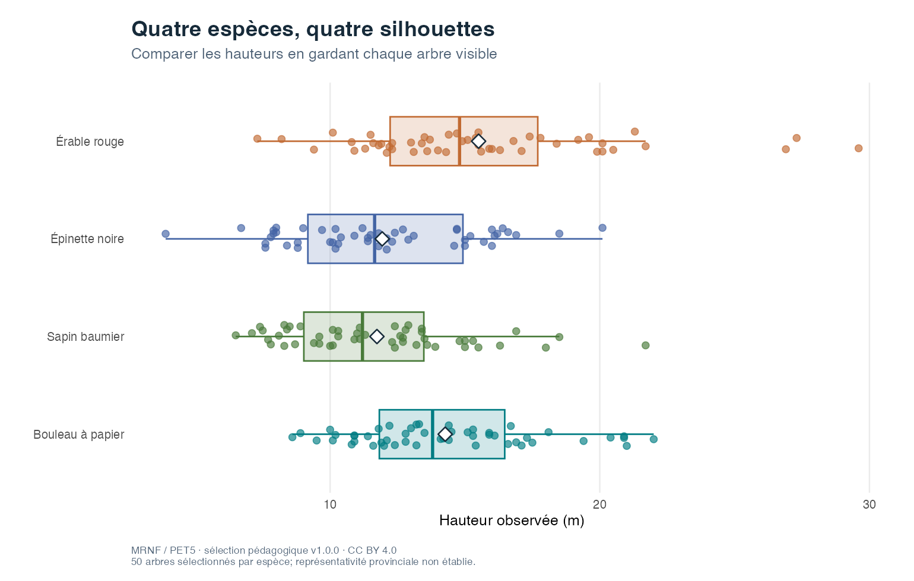

::: {.tool-page}
[Outils et tutoriels](../applications.qmd) / ggplot builder

::: {.tool-hero}
::: {.tool-hero-copy .resource-detail-header}
::: {.resource-kind}
QUÉBEC · FORÊT · GGPLOT2
:::

```{r}
#| label: resource-notice-identity
#| echo: false
#| results: asis
source(if (file.exists("R/utils_resources.R")) "R/utils_resources.R" else "../R/utils_resources.R")
render_resource_notice_identity("ggplot-builder-donnees-bleues")
```

# Construire un graphique, couche après couche

Choisir une mesure, une forme et des couleurs; observer le graphique et le
code qui le produit. L’atelier utilise les 200 arbres du Québec du jeu
pédagogique figé v1.0.0.

::: {.tool-actions}
[Ouvrir le ggplot builder](https://donneesbleues.ca/outils/ggplot-builder/){.dataset-button}
[Voir les données](../datasets/arbres-quebec/fiche.qmd){.dataset-button .secondary}
:::

::: {.tool-author}
Créé par [Aurélien Nicosia](../about.qmd#aurélien-nicosia) · Université Laval

Application Shiny · Exécution dans le navigateur.
:::
:::

::: {.tool-visual}
{fig-alt="Quatre boîtes horizontales montrent les hauteurs des arbres par espèce. Chaque observation est représentée par un point et chaque moyenne par un losange."}

Graphique produit avec le builder et les données MRNF / PET5.
:::
:::

::: {.tool-content}
## Dans l’atelier

- Cinq étapes pour relier les données, la géométrie, les couleurs, les couches et la finition au code ggplot2.
- Des points, des boîtes, des violons, des densités et des histogrammes.
- Des palettes, des facettes, des titres et des thèmes à modifier.
- Des observations individuelles, des moyennes et une droite descriptive à ajouter.
- Le graphique PNG, le code R complet et le CSV original à télécharger.

Les points de départ proposent un portrait des espèces, un nuage
diamètre-hauteur et des distributions. Trois défis invitent à explorer
les couches et les valeurs manquantes.

## Commencer

Choisir « Partir de zéro », puis avancer de « 1 · Données » à « 5 · Finition ».
Consulter le code pour repérer ce que chaque étape ajoute. Les réglages des
étapes suivantes restent mémorisés et apparaissent à l’étape correspondante.

Le premier chargement télécharge R et ses bibliothèques et peut prendre un
moment. L’exécution utilise [Shinylive, par Posit et ses contributeurs](https://posit-dev.github.io/r-shinylive/).
Une connexion est nécessaire au chargement; le CSV est inclus dans l’application.

Pour travailler dans RStudio, télécharger [l’application complète](../assets/tools/ggplot-builder-donnees-bleues.zip)
et exécuter `LANCER.R` dans son dossier. Un [exemple de graphique en R](../assets/tools/ggplot-builder-exemple.R)
est également disponible. Le script R exporté par le builder importe le
CSV versionné depuis Internet et reproduit les réglages choisis.

## Interpréter les graphiques

Le jeu contient 50 arbres par espèce, provenant de 200 placettes distinctes.
Cette sélection équilibrée facilite les comparaisons; elle ne permet pas
d’estimer les proportions des espèces au Québec. Sa représentativité
provinciale n’est pas établie.

L’âge manque pour 52 arbres, dont tous les érables rouges. Le builder indique
les exclusions nécessaires aux mesures choisies, sans imputation. Les
graphiques et les moyennes décrivent uniquement les arbres retenus.
Les densités utilisent une largeur de bande automatique; la droite est
descriptive et ne démontre pas une causalité.

## Sources et réutilisation

MRNF / PET5, sélection pédagogique d’Aurélien Nicosia (2026),
[Arbres du Québec v1.0.0](https://github.com/AurelienNicosiaULaval/arbres_quebec/releases/tag/v1.0.0).
La [fiche des données](../datasets/arbres-quebec/fiche.qmd) documente les
mesures, la provenance et les limites.

Données et contenus pédagogiques : CC BY 4.0. Taxonomie VASCAN : CC0 1.0.
Code original : MIT.
[Consulter le code et les notices](https://github.com/AurelienNicosiaULaval/donnees-bleues/tree/main/applications/ggplot-builder-donnees-bleues).

Le parcours reprend l’idée de construction progressive du
[tutoriel Évolution d’un ggplot](https://aureliennicosia.shinyapps.io/TutorielGGplot/).
Les graphiques et les exports ont été contrôlés techniquement. L’utilisation
en classe n’est pas documentée.
:::
:::
